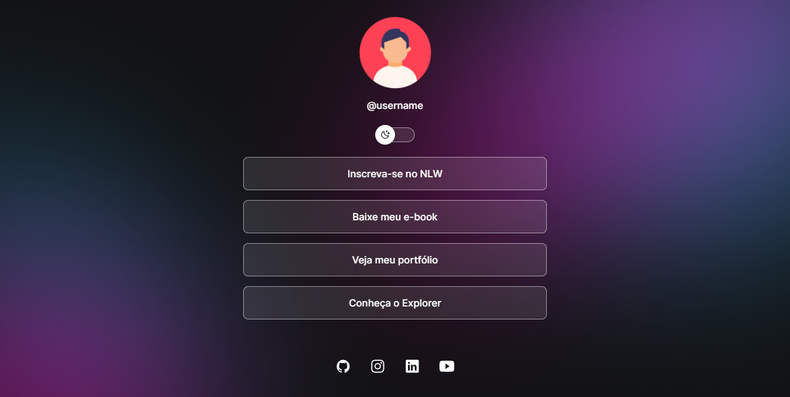

<h1 align="center">Perfil Page</h1>

Perfil page criado a partir do curso Discorver da rocketseat  

  <a href="#-tecnologias">Tecnologias</a>&nbsp;&nbsp;&nbsp;|&nbsp;&nbsp;&nbsp;
  <a href="#-layout">Layout</a>&nbsp;&nbsp;&nbsp;|&nbsp;&nbsp;&nbsp;
  <a href="#memo-licença">Licença</a>

  

 

  

## :rocket: Tecnologias

Esse projeto foi desenvolvido com as seguintes tecnologias:

- HTML, CSS e JS
- Git, Github (actions, pages)
- Figma
- [Rocketseat](rocketseat.com.br)

## :bookmark: Layout

Você pode visualizar o layout do projeto através [DESSE LINK]([https://www.figma.com/community/file/1248257890741817885](https://www.figma.com/file/lxLRKpLM4lua17r8ViEBeV/DevLinks-%E2%80%A2-Projeto-Discover-(Community)?type=design&node-id=58-455&mode=design&t=GTMAqwXpuWWBrQdE-0)https://www.figma.com/file/lxLRKpLM4lua17r8ViEBeV/DevLinks-%E2%80%A2-Projeto-Discover-(Community)?type=design&node-id=58-455&mode=design&t=GTMAqwXpuWWBrQdE-0). É necessário ter conta no [Figma](https://figma.com) para acessá-lo.
